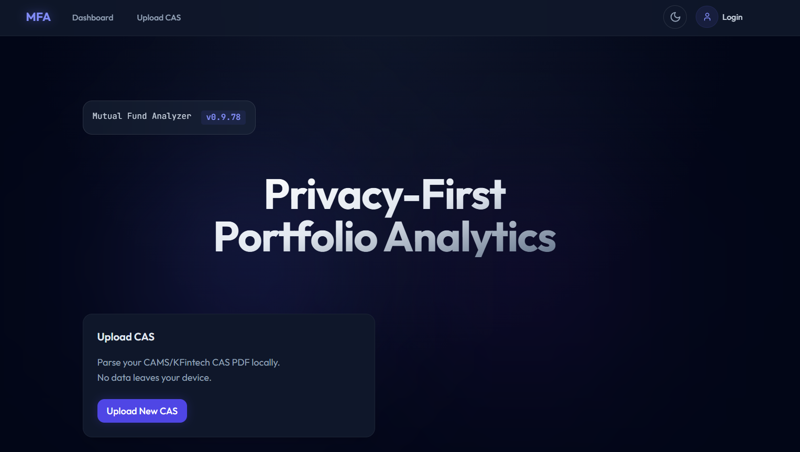
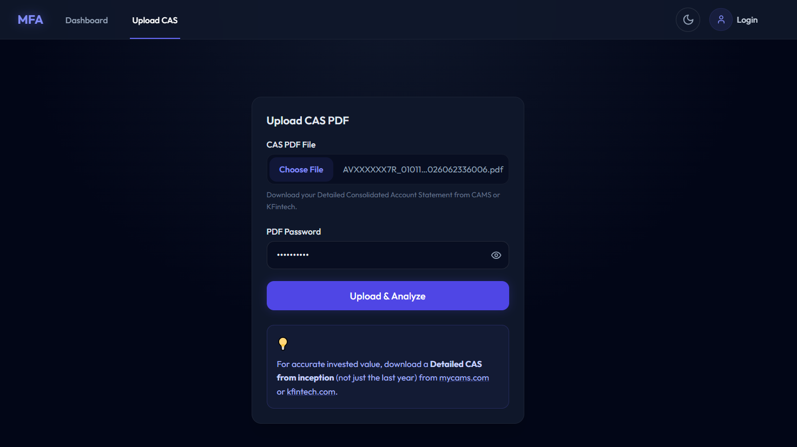
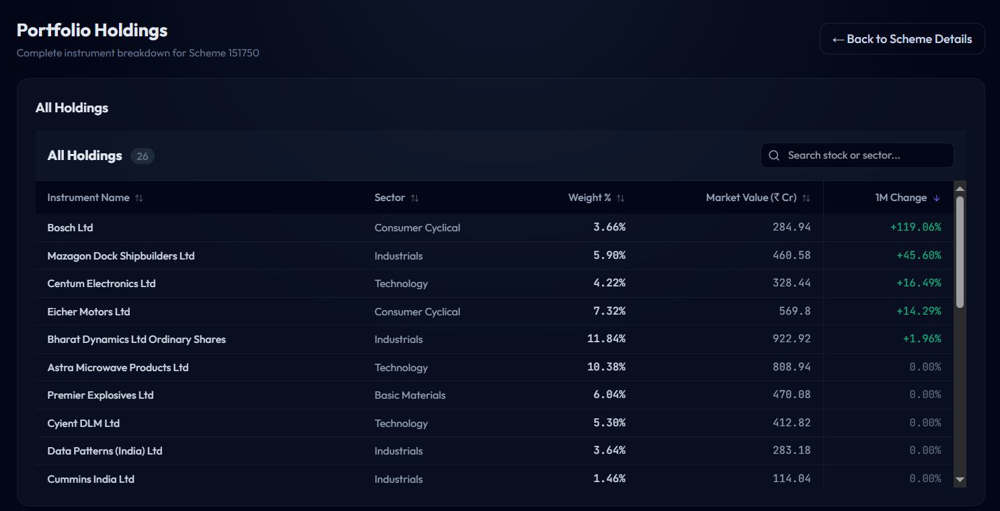
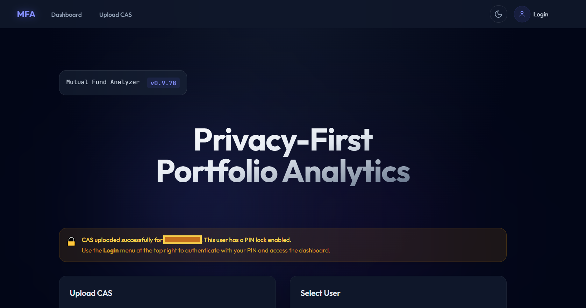
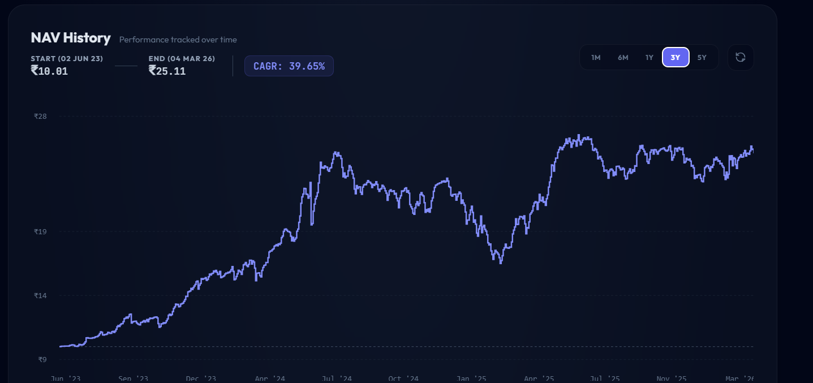
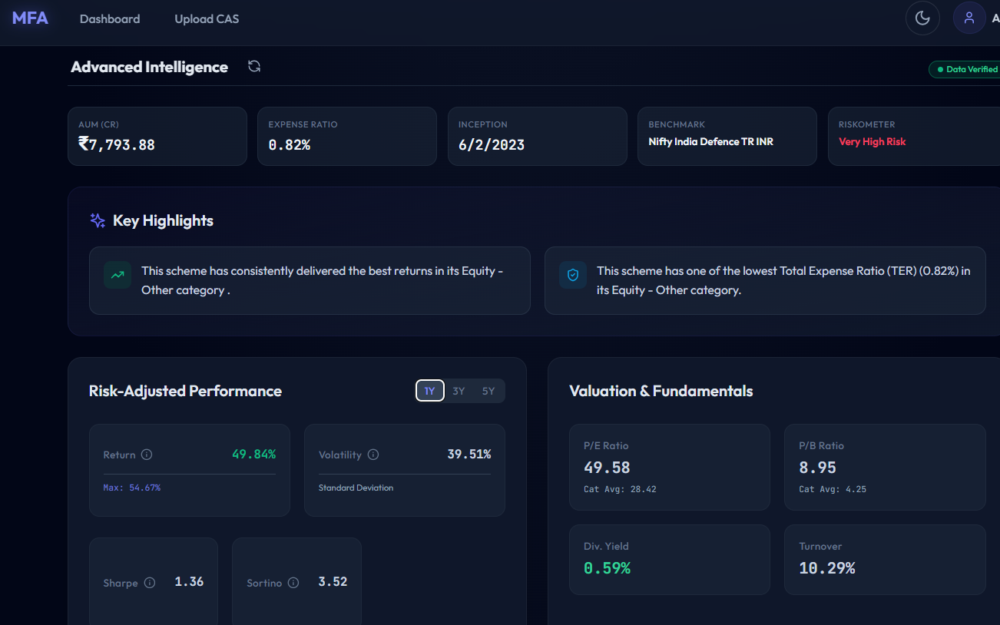
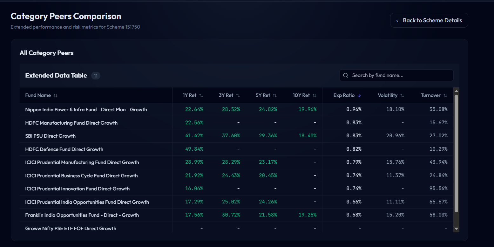

# Mutual Fund Analyzer (MFA)

A privacy-first, personal portfolio analyzer for Indian mutual funds. Upload your CAMS/KARVY Consolidated Account Statement (CAS) PDF and get instant portfolio analytics — XIRR, current value, fund-wise breakdown, historical NAV tracking, and advanced fund intelligence metrics, all processed **locally** on your device.

---

## ✨ Features

- **🛡️ Privacy-First Parsing**: Automatically parse your CAMS/KFintech CAS PDF entirely offline. No sensitive financial data leaves your server.
- **👤 Multi-User Profiles**: Automatically creates user profiles based on PAN numbers found in the CAS, isolated with optional PIN protection.
- **📈 Portfolio Analytics**: Track Invested Value, Current Value, Total Gain, and XIRR at a glance. Accurately builds ledger entries via deterministic transaction hashing.
- **🧠 Fund Intelligence Engine**: Deep insights into each fund including category averages, Risk-Return metrics (Sharpe, Sortino, Beta), Asset/Sector Allocation, Concentration metrics, Valuation Ratios, Debt metrics (YTM, Modified Duration), and Peer group rankings.
- **🔄 Automated NAV Tracking**: Background synchronization keeps your historical NAVs and current portfolio valuations strictly up-to-date.
- **📊 Rich Visualizations**: View interactive historical NAV charts, sector/stock allocations, and compare funds against peers effortlessly.

---

## 📸 Screenshots

<details>
<summary><b>Click to View Application Gallery</b></summary>
<br/>

| Dashboard & Overview | CAS Upload & Protection |
| :---: | :---: |
|  |  |
|  |  |

| Fund Analysis & Intelligence | Comparison & Charts |
| :---: | :---: |
|  |  |
|  |  |

</details>

---

## ⚡ Quick Setup

The easiest way to get started is to clone this repository and spin it up using Docker Compose:

```bash
# Clone the repository
git clone https://github.com/itsddpanda/Personal-Portfolio---MFA.git && cd Personal-Portfolio---MFA

# Build and start the services in the background
docker compose up -d --build
```

**Alternative Modes:**

- **Production / Pre-built Images:** If you want to run exactly the release versions without building from source, download `docker-compose.prod.yml` from the GitHub releases page and run `docker compose -f docker-compose.prod.yml up -d`.
- **Local Dev (No Docker):** You can manually spin up the backend (`cd backend && pip install -r requirements.txt && uvicorn main:app`) and frontend (`cd frontend && npm i && npm run dev`) separately.

---

## 🐳 Docker Images

| Image | URL |
|-------|-----|
| Backend | `ghcr.io/itsddpanda/mfa-backend:latest` |
| Frontend | `ghcr.io/itsddpanda/mfa-frontend:latest` |

The backend API is available at `http://localhost:8001/api`.  
API docs (Swagger UI) at `http://localhost:8001/docs`.

---

## 📦 Tech Stack

| Layer     | Technology          |
| --------- | ------------------- |
| Backend   | FastAPI + SQLite (WAL mode) |
| Frontend  | Next.js 14 (App Router) |
| Container | Docker Compose      |

---

## 🔑 Environment Variables

### Backend (`backend/.env`)

| Variable        | Default                             | Description                          |
| --------------- | ----------------------------------- | ------------------------------------ |
| `DATABASE_URL`  | `sqlite:////data/mfa.db`            | SQLite database path (inside Docker volume) |
| `CORS_ORIGINS`  | `http://localhost:3001,...`         | Comma-separated allowed origins      |

---

## 📁 Project Structure

```text
mfa/
├── backend/                 # FastAPI application
│   ├── app/
│   │   ├── api/             # Route handlers
│   │   ├── services/        # Business logic
│   │   ├── models/          # SQLModel ORM models
│   │   └── db/              # Database engine setup
│   ├── main.py              # App entrypoint
│   └── requirements.txt
├── frontend/                # Next.js application
│   └── src/
├── assets/                  # Images for README and documentation
├── docs/                    # Design specs, PRDs, and architecture docs
├── setup.sh                 # One-step setup script
├── docker-compose.yml       # Build from source
└── docker-compose.prod.yml  # Deploy from pre-built images
```

---

## 🏥 Health Check

```bash
curl http://localhost:8001/api/health
# {"status": "ok", "service": "mfa-backend"}
```
