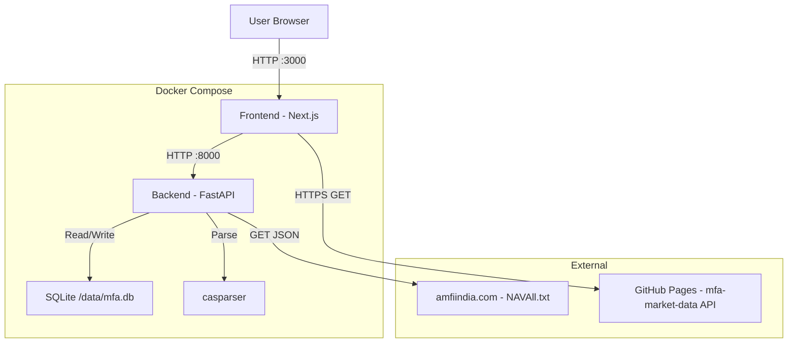

# Architecture: Privacy-First Mutual Fund Analyzer

**Date:** 2026-02-18
**Last Updated:** 2026-02-22
**Status:** Implemented

## 1. Stack Strategy
- **Containerization:** Docker Compose (Single entry point `docker compose up`).
- **Frontend:** Next.js 14 (App Router) — TypeScript, React, lucide-react icons.
- **Backend:** Python (FastAPI) — Required for `casparser` ecosystem.
- **Database:** SQLite (WAL mode) — Zero-config, single-file persistence at `/data/mfa.db`.
- **ORM:** SQLModel (Pydantic + SQLAlchemy) — Ideal for FastAPI.

## 2. Component Diagram



## 3. The `mfa-market-data` Scraping Pipeline (External Component)
The `mfa-market-data` project exists as a standalone, serverless data pipeline designed to scrape, compile, and distribute heavy financial market data (Sector Allocations, Top Holdings, Expense Ratios).

It solves the compute constraint of the primary MFA application by strictly acting as a read-only, statically hosted JSON API. It is architected for zero hosting fees:
- **Compute Layer:** GitHub Actions (scheduled daily `scrape_data.yml`).
- **Scraping Layer:** Python script fetching data from Morningstar India and AMFI India.
- **Output:** Compiles data into static JSON files (`/out/api/schemes/120621.json`).
- **Hosting Layer:** GitHub Pages hosts the `/out/` directory on the `gh-pages` branch, serving as a global CDN.

The local MFA application integrates with this by making standard client-side `fetch()` queries directly from the Next.js `Scheme Details` page. If the user is offline, the fetch gracefully fails and sector charts are hidden to protect the core offline experience.

## 4. Data Model

### Shared Reference Data
| Model | Key Fields | Notes |
|---|---|---|
| **AMC** | `id`, `name`, `code` (unique) | Auto-extracted from CAS |
| **Scheme** | `id`, `isin` (unique), `amfi_code`, `name`, `type`, `advisor`, `amc_id`, `latest_nav`, `latest_nav_date`, `last_history_sync` | `last_history_sync` throttles backfills |
| **NavHistory** | `id`, `scheme_id`, `date`, `nav` | Unique constraint on `(scheme_id, date)` |
| **SystemState** | `key` (unique), `value`, `updated_at` | Used for tracking background sync status |

### Private User Data
| Model | Key Fields | Notes |
|---|---|---|
| **User** | `id` (UUID), `name`, `pan` (unique), `pin_hash`, `created_at` | Auto-created from CAS PAN |
| **Portfolio** | `id`, `user_id`, `name` | One per user |
| **Folio** | `id`, `portfolio_id`, `amc_id`, `folio_number` | Linked to AMC |
| **Transaction** | `id` (SHA-256 hash), `folio_id`, `scheme_id`, `date`, `type`, `amount`, `units`, `nav`, `balance` | Deduplicated via composite key |

### Transaction ID Generation
```
SHA-256( "{PAN}|{ISIN}|{date}|{amount}|{type}|{units}" )
```

## 4. API Reference (Actual Endpoints)

### CAS Processing (`/api`)
| Method | Path | Headers | Description |
|---|---|---|---|
| `POST` | `/api/upload` | `x-user-id` (optional) | Upload CAS PDF + password. Creates User/Portfolio/Schemes/Transactions. Returns import summary. Max 10MB. Triggers async NAV history backfill. |

### Scheme Details (`/api/schemes`)
| Method | Path | Headers | Description |
|---|---|---|---|
| `GET` | `/api/schemes/{amfi_code}` | `x-user-id` (required) | Full scheme page data: metadata (lazy-loaded from `mfapi.in`), per-scheme KPIs (XIRR, invested, current), and chronological transaction ledger with running unit balance. |
| `GET` | `/api/schemes/{amfi_code}/history` | — | Returns chronological NAV history for UI charting. |
| `POST` | `/api/schemes/{amfi_code}/backfill` | — | Manually triggers background backfill for 10-year NAV history from `mfapi.in`. |

### NAV Sync (`/api`)
| Method | Path | Headers | Description |
|---|---|---|---|
| `POST` | `/api/sync-nav` | `x-user-id` (required) | Triggers the AMFI script synchronously, and explicitly uses `mfapi.in` as a fallback for missing/inactive schemes. Returns updated summary. |

### Status (`/api/status`)
| Method | Path | Description |
|---|---|---|
| `GET` | `/api/status/sync` | Returns background cron job sync status `{"is_syncing": bool, "last_synced": str}` |

### Analytics (`/api/analytics`)
| Method | Path | Headers | Description |
|---|---|---|---|
| `GET` | `/api/analytics/summary` | `x-user-id` (required) | Returns total invested, current value, XIRR, and per-scheme holdings with FIFO cost basis. |

### Users (`/api/users`)
| Method | Path | Body | Description |
|---|---|---|---|
| `GET` | `/api/users/` | — | Lists all users with `{id, name, is_pin_set}`. |
| `POST` | `/api/users/{id}/verify-pin` | `{pin}` | Validates PIN against stored hash. |
| `POST` | `/api/users/{id}/set-pin` | `{pin}` | Sets/updates 4-digit PIN (stored as SHA-256). |
| `POST` | `/api/users/{id}/remove-pin` | `{pin}` | Removes PIN after verifying the current PIN. |

### System
| Method | Path | Description |
|---|---|---|
| `GET` | `/api/health` | Returns `{"status": "ok"}`. |

## 5. Background Processes

- **AMFI Bulk Sync Cron Job (`scripts/sync_amfi.py`)**: Runs every 12 hours inside the backend container. Fetches `NAVAll.txt` from AMFI, parses it, updates all internal schemes, and maintains status in `SystemState`. Incorporates a **4-hour internal cache** to prevent duplicate heavy processing.

## 6. Frontend Pages

| Route | Component | Description |
|---|---|---|
| `/` | `page.tsx` | Home/landing — Displays User Selection if users exist (even if logged out) |
| `/upload` | `upload/page.tsx` | CAS PDF upload with 3-phase progress (Upload → Parse → Sync). Includes tip to download a full-history CAS. |
| `/dashboard` | `dashboard/page.tsx` | KPI cards (value, invested, XIRR) + holdings table + passive background sync polling. Shows amber banner for estimated holdings. |
| `/holdings` | `holdings/page.tsx` | Full holdings list view |
| `/drilldown/current-value` | `drilldown/current-value/page.tsx` | Detailed breakdown of Current Value (Units × NAV per scheme) |
| `/drilldown/invested-value` | `drilldown/invested-value/page.tsx` | Detailed breakdown of Invested Value (FIFO cost basis per scheme) |
| `/drilldown/xirr` | `drilldown/xirr/page.tsx` | Per-scheme XIRR breakdown with edge-case handling (< 1yr, Estimated, Dead Funds) |
| `/drilldown/total-gain` | `drilldown/total-gain/page.tsx` | Total gain/loss drilldown view |
| `/scheme/[amfi_code]` | `scheme/[amfi_code]/page.tsx` | Scheme Details: 10-Year NAV chart, isolated KPIs, full transaction ledger with running unit balance |

### Shared Components
- **Navbar** (`Navbar.tsx`): Sticky top bar with MFA logo, Dashboard/Upload links, active-state highlighting.
- **UserMenu** (`UserMenu.tsx`): Always visible user avatar dropdown. Handles Login/Switch-user, PIN set/verify/remove modal, logout.
- **ThemeProvider** (`ThemeProvider.tsx`): Context provider for dark/light mode. Wraps the root layout.
- **ThemeToggle** (`ThemeToggle.tsx`): Icon button in Navbar to toggle between dark and light themes.
- **NAVChart** (`charts/NAVChart.tsx`): Responsive Recharts component displaying historical NAV performance with 1Y/3Y/5Y/MAX range toggles.

## 7. Key Workflows

### 1. CAS Import
1. Backend parses PDF via `casparser`. `cas_schema.json` and `cas_import.json` debug dumps are natively written to `/data/` for parser debugging.
2. If PAN not in DB → Create User + Portfolio (If triggered via frontend upload with PAN mismatch, prompts user native confirmation modal first).
3. For each scheme: extract ISIN, clean name (strip ISIN suffix), create/update Scheme + AMC.
4. For each transaction → Hash → Deduplicate → Insert if new.
5. **Synthetic OPENING_BALANCE**: If scheme has `open > 0` units, generate an `OPENING_BALANCE` transaction **only if no prior transaction history exists** for that scheme.
6. **Reconciliation**: If real historical transactions are imported that precede an existing OPENING_BALANCE, any synthetic entries occurring strictly AFTER the first real transaction date are deleted to prevent double-counting.

### 2. Dashboard Load
1. Frontend sends `GET /api/analytics/summary` with `x-user-id` header.
2. Backend calculates:
   - **Net Units** = SQL SUM with CASE (outflow types × -1).
   - **Current Value** = Net Units × `scheme.latest_nav`.
   - **Invested Value** = FIFO cost basis (remaining lots after outflows).
   - **XIRR** = `pyxirr` on full transaction history.
3. Frontend renders KPI cards and holdings table, and simultaneously polls `/api/status/sync` to check for fresh NAVs.

### 3. Re-Login & Switching
1. Active user stored in `localStorage('mfa_user_id')`.
2. Even if logged out, User Menu fetches `/api/users/` and displays a user list.
3. User selects a profile. If target user has PIN → modal prompt → `POST /api/users/{id}/verify-pin`.
4. On success → update localStorage → route to `/dashboard`.

### 4. Dual-Source NAV Backfill (V1.4.1 Architecture)
**Goal:** Prevent N+1 query loops and massive network bloat when updating charting data for 5+ missing days.
**Strategy (The Router):** Triggered when `today - last_history_sync > 7 days` or `None`. 
1. **Brand New Scheme (`gap == None`):** 
   - Routes to `mfapi.in` to fetch the 10-year JSON dump (~80 KB). Bulk `UPSERT` whole array. Fast (0.5s network).
2. **Maintenance Gap (`7 < gap <= 30 days`):** 
   - Routes to AMFI Scraper (`portal.amfiindia.com/...frmdt=`). 
   - Loops single-day requests for the missing dates (highly optimized AMFI endpoint serves all funds for 1 date in 0.5s / 1MB).
3. **Massive Gap (`gap > 30 days`):**
   - Routing dynamic failsafe: Rather than looping AMFI 30+ times, it mathematically reroutes to the 10-year `mfapi.in` payload. Modifies it via RAM slicing (`[d for d in payload if d.date > max_date]`) and blindly bulk-inserts via SQLite constraint.

## 8. Security & Privacy
- **PAN Storage:** Stored as plain text (DB is local, user-owned).
- **PIN Storage:** SHA-256 hash in `User.pin_hash`.
- **Network:** No inbound internet access; only outbound to `amfiindia.com`.
- **CORS:** Configurable via `CORS_ORIGINS` env var (default: `localhost:3000`).

## 9. Known Limitations
- Uvicorn runs without `--reload` — code changes require `docker compose restart backend`.
- FIFO invested value excludes stamp duty (typically ~₹90 delta vs CAS total).
