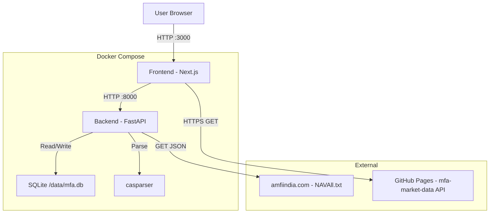

# Mutual Fund Analyzer — Product Requirements Document

**Version:** 1.5.0
**Date:** 2026-02-28
**Last Updated:** 2026-02-28
**Status:** Production Released

## 1. Executive Summary
A privacy-first, offline-capable web application for Indian investors to track and analyze their mutual fund portfolios. It parses Consolidated Account Statements (CAS) locally, manages multi-user portfolios using a unique PAN-based identity system, and provides deep insights (XIRR, FIFO cost basis) without sending sensitive data to external servers.

### Personas
- **The Privacy-Conscious Investor:** Zero tolerance for uploading financial data to cloud/third-party servers.
- **The Household CFO:** Manages portfolios for self, spouse, and parents on a single device, requiring clean separation of data.

## 2. Verified Constraints & Technical Discovery
| Dimension | Constraint | Source |
|---|---|---|
| **CAS Parsing** | Must use **Python `casparser`** library. JS alternatives are immature or API-dependent. | Technical Discovery |
| **State Management** | "Active User" state is client-side (`localStorage`). Backend is stateless for "Login". | User Requirement |
| **Authentication** | No cloud auth. "Login" = Client holding a specific `user_id`. | Technical Constraint |
| **Security** | "Logout" is a client-side session clear. Data remains in SQLite. | Technical Constraint |
| **Transaction Types** | Transaction type strings use underscores (`SWITCH_OUT`, `PURCHASE_SIP`), not spaces. | RCA: Type Mismatch Bug |

## 3. Hardened Requirements & Edge Cases
| Scenario | Handling Strategy |
|---|---|
| **Invalid Password** | Immediate error return from parser; no lockout. |
| **PAN Mismatch** | If loaded CAS PAN != Active User PAN → Prompt to switch profile or create new user. |
| **Gap in Data** | If Transaction Cost is missing → Use CAS-provided "Total Cost" for summary. |
| **API Failure** | If `mfapi.in` is down/offline → Show last known NAV + "Stale Data" warning. |
| **Deduplication** | **Strict Composite Key:** `SHA-256(PAN\|ISIN\|Date\|Amount\|Type\|Units)`. Synthetic `OPENING_BALANCE` is skipped if prior history exists.|
| **Opening Balance** | If a scheme has `units.open > 0` but no transactions, a synthetic `OPENING_BALANCE` transaction is created. |
| **Opening Balance Reconciliation** | When real historical transactions are imported that precede an existing `OPENING_BALANCE`, the synthetic entry is **deleted** to prevent double-counting. See [RCA: Reconciliation](file:///home/panda/mfa/docs/rca/RCA_CONSOLIDATED.md) and [RCA: Dedup Conflict](file:///home/panda/mfa/docs/rca/RCA_CAS_Deduplication_Bug.md). |
| **Switching User** | Select from Dropdown. If User B has a PIN → Prompt for PIN. Success → Update `localStorage`. |
| **Forgotten PIN** | MVP Scope: No "Reset". User must re-upload CAS to regenerate/reset, or manual DB intervention. |
| **Zero Users** | `GET /api/users/` returns empty list. Home Page shows default "Get Started". |
| **Negative Units** | Outflow transactions (SWITCH_OUT, REDEMPTION) store negative units. Analytics must use `abs()`. See [RCA](file:///home/panda/mfa/docs/rca/RCA_CONSOLIDATED.md). |
| **Scheme Name Cleaning** | ISIN suffix (` - ISIN: ...`) is stripped from scheme names during CAS import. |

## 4. Architecture & Stack
**Rationale:** Chosen for local-first robustness and Python ecosystem access.
- **Containerization:** Docker Compose (Single entry point `docker compose up`).
- **Frontend:** Next.js 14 (App Router) — TypeScript, React, lucide-react icons.
- **Backend:** Python (FastAPI) — Required for `casparser` ecosystem.
- **Database:** SQLite (WAL mode) — Zero-config, single-file persistence at `/data/mfa.db`.
- **ORM:** SQLModel (Pydantic + SQLAlchemy) — Ideal for FastAPI.

> See [DB-PRD.md](DB-PRD.md) for full database data model and schema implementations.

### Component Diagram



### The `mfa-market-data` Scraping Pipeline (External Component)
The `mfa-market-data` project exists as a standalone, serverless data pipeline designed to scrape, compile, and distribute heavy financial market data (Sector Allocations, Top Holdings, Expense Ratios).

It solves the compute constraint of the primary MFA application by strictly acting as a read-only, statically hosted JSON API. It is architected for zero hosting fees:
- **Compute Layer:** GitHub Actions (scheduled daily `scrape_data.yml`).
- **Scraping Layer:** Python script fetching data from Morningstar India and AMFI India.
- **Output:** Compiles data into static JSON files (`/out/api/schemes/120621.json`).
- **Hosting Layer:** GitHub Pages hosts the `/out/` directory on the `gh-pages` branch, serving as a global CDN.

The local MFA application integrates with this by making standard client-side `fetch()` queries directly from the Next.js `Scheme Details` page. If the user is offline, the fetch gracefully fails and sector charts are hidden to protect the core offline experience.

## 5. API Reference (Actual Endpoints)

### CAS Processing (`/api`)
| Method | Path | Headers | Description |
|---|---|---|---|
| `POST` | `/api/upload` | `x-user-id` (optional) | Upload CAS PDF + password. Creates User/Portfolio/Schemes/Transactions. Returns import summary. Max 10MB. Triggers async NAV history backfill. |

### Scheme Details (`/api/schemes`)
| Method | Path | Headers | Description |
|---|---|---|---|
| `GET` | `/api/schemes/{amfi_code}` | `x-user-id` (required) | Full scheme page data: metadata (lazy-loaded from `mfapi.in`), per-scheme KPIs (XIRR, invested, current), and chronological transaction ledger with running unit balance. |
| `GET` | `/api/schemes/{amfi_code}/history` | — | Returns chronological NAV history for UI charting. |
| `POST` | `/api/schemes/{amfi_code}/backfill` | — | Manually triggers background backfill for 10-year NAV history from `mfapi.in`. |

### NAV Sync (`/api`)
| Method | Path | Headers | Description |
|---|---|---|---|
| `POST` | `/api/sync-nav` | `x-user-id` (required) | Triggers the AMFI script synchronously, and explicitly uses `mfapi.in` as a fallback for missing/inactive schemes. Returns updated summary. |

### Status (`/api/status`)
| Method | Path | Description |
|---|---|---|
| `GET` | `/api/status/sync` | Returns background cron job sync status `{"is_syncing": bool, "last_synced": str}` |

### Analytics (`/api/analytics`)
| Method | Path | Headers | Description |
|---|---|---|---|
| `GET` | `/api/analytics/summary` | `x-user-id` (required) | Returns total invested, current value, XIRR, and per-scheme holdings with FIFO cost basis. |

### Users (`/api/users`)
| Method | Path | Body | Description |
|---|---|---|---|
| `GET` | `/api/users/` | — | Lists all users with `{id, name, is_pin_set}`. |
| `POST` | `/api/users/{id}/verify-pin` | `{pin}` | Validates PIN against stored hash. |
| `POST` | `/api/users/{id}/set-pin` | `{pin}` | Sets/updates 4-digit PIN (stored as SHA-256). |
| `POST` | `/api/users/{id}/remove-pin` | `{pin}` | Removes PIN after verifying the current PIN. |

### System
| Method | Path | Description |
|---|---|---|
| `GET` | `/api/health` | Returns `{"status": "ok"}`. |

## 6. Background Processes

- **AMFI Bulk Sync Cron Job (`scripts/sync_amfi.py`)**: Runs every 12 hours inside the backend container. Fetches `NAVAll.txt` from AMFI, parses it, updates all internal schemes, and maintains status in `SystemState`. Incorporates a **4-hour internal cache** to prevent duplicate heavy processing.

## 7. Frontend Pages

| Route | Component | Description |
|---|---|---|
| `/` | `page.tsx` | Home/landing — Displays User Selection if users exist (even if logged out) |
| `/upload` | `upload/page.tsx` | CAS PDF upload with 3-phase progress (Upload → Parse → Sync). Includes tip to download a full-history CAS. |
| `/dashboard` | `dashboard/page.tsx` | KPI cards (value, invested, XIRR) + holdings table + passive background sync polling. Shows amber banner for estimated holdings. |
| `/holdings` | `holdings/page.tsx` | Full holdings list view |
| `/drilldown/current-value` | `drilldown/current-value/page.tsx` | Detailed breakdown of Current Value (Units × NAV per scheme) |
| `/drilldown/invested-value` | `drilldown/invested-value/page.tsx` | Detailed breakdown of Invested Value (FIFO cost basis per scheme) |
| `/drilldown/xirr` | `drilldown/xirr/page.tsx` | Per-scheme XIRR breakdown with edge-case handling (< 1yr, Estimated, Dead Funds) |
| `/drilldown/total-gain` | `drilldown/total-gain/page.tsx` | Total gain/loss drilldown view |
| `/scheme/[amfi_code]` | `scheme/[amfi_code]/page.tsx` | Scheme Details: 10-Year NAV chart, isolated KPIs, full transaction ledger with running unit balance |

### Shared Components
- **Navbar** (`Navbar.tsx`): Sticky top bar with MFA logo, Dashboard/Upload links, active-state highlighting.
- **UserMenu** (`UserMenu.tsx`): Always visible user avatar dropdown. Handles Login/Switch-user, PIN set/verify/remove modal, logout.
- **ThemeProvider** (`ThemeProvider.tsx`): Context provider for dark/light mode. Wraps the root layout.
- **ThemeToggle** (`ThemeToggle.tsx`): Icon button in Navbar to toggle between dark and light themes.
- **NAVChart** (`charts/NAVChart.tsx`): Responsive Recharts component displaying historical NAV performance with 1Y/3Y/5Y/MAX range toggles.

## 8. Key Workflows

### 1. CAS Import
1. Backend parses PDF via `casparser`. `cas_schema.json` and `cas_import.json` debug dumps are natively written to `/data/` for parser debugging.
2. If PAN not in DB → Create User + Portfolio (If triggered via frontend upload with PAN mismatch, prompts user native confirmation modal first).
3. For each scheme: extract ISIN, clean name (strip ISIN suffix), create/update Scheme + AMC.
4. For each transaction → Hash → Deduplicate → Insert if new.
5. **Synthetic OPENING_BALANCE**: If scheme has `open > 0` units, generate an `OPENING_BALANCE` transaction **only if no prior transaction history exists** for that scheme.
6. **Reconciliation**: If real historical transactions are imported that precede an existing OPENING_BALANCE, any synthetic entries occurring strictly AFTER the first real transaction date are deleted to prevent double-counting.

### 2. Dashboard Load
1. Frontend sends `GET /api/analytics/summary` with `x-user-id` header.
2. Backend calculates:
   - **Net Units** = SQL SUM with CASE (outflow types × -1).
   - **Current Value** = Net Units × `scheme.latest_nav`.
   - **Invested Value** = FIFO cost basis (remaining lots after outflows).
   - **XIRR** = `pyxirr` on full transaction history.
3. Frontend renders KPI cards and holdings table, and simultaneously polls `/api/status/sync` to check for fresh NAVs.

### 3. Re-Login & Switching
1. Active user stored in `localStorage('mfa_user_id')`.
2. Even if logged out, User Menu fetches `/api/users/` and displays a user list.
3. User selects a profile. If target user has PIN → modal prompt → `POST /api/users/{id}/verify-pin`.
4. On success → update localStorage → route to `/dashboard`.

### 4. Dual-Source NAV Backfill (V1.4.1 Architecture)
**Goal:** Prevent N+1 query loops and massive network bloat when updating charting data for 5+ missing days.
**Strategy (The Router):** Triggered when `today - last_history_sync > 7 days` or `None`. 
1. **Brand New Scheme (`gap == None`):** 
   - Routes to `mfapi.in` to fetch the 10-year JSON dump (~80 KB). Bulk `UPSERT` whole array. Fast (0.5s network).
2. **Maintenance Gap (`7 < gap <= 30 days`):** 
   - Routes to AMFI Scraper (`portal.amfiindia.com/...frmdt=`). 
   - Loops single-day requests for the missing dates (highly optimized AMFI endpoint serves all funds for 1 date in 0.5s / 1MB).
3. **Massive Gap (`gap > 30 days`):**
   - Routing dynamic failsafe: Rather than looping AMFI 30+ times, it mathematically reroutes to the 10-year `mfapi.in` payload. Modifies it via RAM slicing (`[d for d in payload if d.date > max_date]`) and blindly bulk-inserts via SQLite constraint.

## 9. Security & Privacy
- **PAN Storage:** Stored as plain text (DB is local, user-owned).
- **PIN Storage:** SHA-256 hash in `User.pin_hash`.
- **Network:** No inbound internet access; only outbound to `amfiindia.com`.
- **CORS:** Configurable via `CORS_ORIGINS` env var (default: `localhost:3000`).

## 10. Known Limitations
- Uvicorn runs without `--reload` — code changes require `docker compose restart backend`.
- FIFO invested value excludes stamp duty (typically ~₹90 delta vs CAS total).


## 11. Epics & User Stories
### Epic 1: Core Infrastructure
- **1.1:** [Done] Setup Docker Compose (FastAPI + Next.js + SQLite). `Priority: Must Have`

### Epic 2: CAS Processing
- **2.1:** [Done] Upload & Parse CAS PDF (Password protected). `Priority: Must Have`
- **2.2:** [Done] Transaction Deduplication via Composite Key. `Priority: Must Have`
- **2.3:** [Done] Synthetic Opening Balance + **Reconciliation on multi-CAS import**. `Priority: Must Have`
- **2.4:** [Done] Scheme Name Cleaning (strip ISIN suffix). `Priority: Should Have`
- **2.5:** [Done] AMC Extraction & Normalization. `Priority: Should Have`

### Epic 3: Portfolio Management
- **3.1:** [Done] Auto-create User Profile from PAN in CAS. `Priority: Must Have`
- **3.2:** [Done] Profile Warning on PAN Mismatch. `Priority: Should Have`
- **3.3:** [Done] **Global Navbar:** Persistent top bar with Home/Dashboard/Upload links. `Priority: Must Have`
- **3.4:** [Done] **User Listing & Menu:** Switch users via dropdown. `Priority: Must Have`
- **3.5:** [Done] **Logout:** Clear session from browser. `Priority: Must Have`
- **3.6:** [Done] **Re-Login UX:** Display user selection cards on Home and Navbar even if logged out. `Priority: Must Have`

### Epic 4: Market Data Sync
- **4.1:** [Done] Fetch Live NAVs via AMFI Bulk Text file. `Priority: Must Have`
- **4.2:** [Done] Auto-sync NAV via background cron job (12-hour interval). `Priority: Should Have`

### Epic 5: Analytics
- **5.1:** [Done] Dashboard with Total Value & XIRR. `Priority: Must Have`
- **5.2:** [Done] Holdings Table. `Priority: Should Have`
- **5.3:** [Done] **FIFO Cost Basis** for accurate Invested Value. `Priority: Must Have`

### Epic 6: Offline Capability
- **6.1:** [Done] Local `casparser` processing. `Priority: Must Have`
- **6.2:** [Done] Graceful failure when offline. `Priority: Should Have`

### Epic 7: Frontend Interface
- **7.1:** [Done] Upload Page (PDF + Password) with 3-phase progress. `Priority: Must Have`
- **7.2:** [Done] Dashboard View (KPI Cards + Holdings + Async Status). `Priority: Must Have`
- **7.3:** [Done] Smart Home Redirect (logged-in detection / user select). `Priority: Should Have`
- **7.4:** [Done] Password Toggle on upload form. `Priority: Nice to Have`

### Epic 8: Security
- **8.1:** [Done] **PIN Protection:** Optional 4-digit PIN (SHA-256 hashed). `Priority: Should Have`

### Epic 9: Enhancements (V1.2)

#### Feature 9.1: Direct Profile Creation
- **Story 9.1.1:** As a user uploading a CAS for a new PAN, I want the system to prompt me to create a new profile immediately so that I don't have to manually log out first.
  - *AC:* If PAN not in DB during upload, prompt "CAS belongs to new user. Create & switch?".
  - *AC:* If accepted, parse CAS, create User/Portfolio, set `localStorage` active user, and redirect to Dashboard.
  - *Priority:* Must Have | *Size:* M

#### Feature 9.2: NAV Status Transparency
- **Story 9.2.1:** As a user, I want to see the exact date of my NAV data and have a button to force a sync so that I know exactly how fresh my data is.
  - *AC:* Replace "NAV Data: Live" with "Latest NAV Date: {Max Date from portfolio holdings}".
  - *AC:* Add "Force Sync" button that triggers `POST /api/sync-nav` or equivalent to explicitly run the AMFI fetch.
  - *Priority:* Must Have | *Size:* S

#### Feature 9.3: Reliable AMFI Sync
- **Story 9.3.1:** [Done] As a user, I want all my active schemes to sync their NAVs correctly so that I don't see missing data on my dashboard.
  - *AC:* Fix `sync_amfi.py` parser logic which is currently skipping valid schemes like `146130` despite them being present in `NAVAll.txt`.
  - *Priority:* Must Have | *Size:* S

### Epic 10: Invested Value Accuracy & UX (V1.3)

#### Feature 10.1: Estimated Holdings Transparency
- **Story 10.1.1:** [Done] As a user, I want to see a warning on the dashboard when my invested value may be understated, so that I understand the data limitation.
  - *AC:* Backend returns `has_estimated_holdings: true` and `estimated_schemes_count: N` in the analytics summary when any scheme has `OPENING_BALANCE` transactions.
  - *AC:* Dashboard shows a dismissible amber banner: "Some holdings were carried forward without transaction history. Invested Value may be understated. Upload a full-history CAS to fix this."
  - *Priority:* Must Have | *Size:* S

- **Story 10.1.2:** [Done] As a user, I want to see which specific schemes have estimated invested values, so I know exactly what's affected.
  - *AC:* In the holdings table, schemes with `OPENING_BALANCE` show a "⚠️ Estimated" badge next to their invested value.
  - *Priority:* Should Have | *Size:* S

#### Feature 10.2: Upload Guidance
- **Story 10.2.1:** [Done] As a user, I want guidance on the upload page about downloading the right type of CAS, so I can get accurate data from the start.
  - *AC:* Upload page shows a tip: "For accurate invested value, download a Detailed CAS from inception (not just the last year)".
  - *Priority:* Must Have | *Size:* XS

#### Feature 10.3: Resolution Feedback
- **Story 10.3.1:** [Done] As a user who has just uploaded a full-history CAS after a partial one, I want feedback that my data has been corrected.
  - *AC:* After upload + reconciliation, if OPENING_BALANCE entries were deleted, show a success toast: "Full transaction history imported! Invested value updated for X schemes."
  - *Priority:* Should Have | *Size:* S

### Epic 11: Portfolio Charting & Deep Analytics (V1.4)

#### Feature 11.1: 10-Year NAV History
- **Story 11.1.1:** [Done] As a user, I want to see historical NAV charts for my holdings, so I can visualize performance over time.
  - *AC:* Store dense NAV history (daily) for all held schemes via `mfapi.in` async fetches.
  - *AC:* Provide an API endpoint (`/api/schemes/{amfi_code}/history`) for historical NAV data per scheme.
  - *AC:* Provide an interactive frontend `recharts` component with 1Y, 3Y, 5Y, and MAX toggles.
  - *Priority:* Could Have | *Size:* L | *Status:* ✅ Implemented


### Epic 12: Architecture & Stability Hardening (V1.3.1)

#### Feature 12.1: Stale Data Reliability
- **Story 12.1.1:** [Done] As an Investor, I want the system to aggressively sync NAV data if it is older than 3 days, so that my portfolio valuations remain accurate.
- **Story 12.1.2:** [Done] As an Investor, I want to see a visual warning (Critical Failure banner) if my NAV data is dangerously out of date, so that I don't make decisions on stale data.

#### Feature 12.2: Upload Transparency
- **Story 12.2.1:** [Done] As an Investor, I want to see exactly how many transactions were imported versus skipped in the success message, so I know my upload was processed accurately.

#### Feature 12.3: Bug Fixes & Stability (PR Review Responses)
- **Story 12.3.1:** [Done] As a System, I want the dashboard polling interval to be safe from infinite loops.
- **Story 12.3.2:** [Done] As a User, I expect the UI to remain stable when I resolve a PAN mismatch. 
- **Story 12.3.3:** [Done] As an application, I want all frontend API calls to use the configured API_BASE instead of hardcoded URIs.
- **Story 12.3.4:** [Done] As a Developer, I want Docker container booting to explicitly fail if cron fails.
- **Story 12.3.5:** [Done] As an Investor viewing Estimated Holdings, I want to be redirected correctly and shown "No Data" instead of a crash.
- **Story 12.3.6:** [Done] As a Developer, I want debug files to represent all transactions to verify CAS parsing correctly.

### Epic 13: Dashboard Drilldown Views (V1.3.2)

#### Feature 13.1: KPI Card Drilldowns
- **Story 13.1.1:** [Done] As a user, I want the titles of the KPI cards (Current Value, Invested Value, etc.) to be clickable links, so that I understand they lead to more detailed breakdowns.
- **Story 13.1.2:** [Done] As a user, when I click "Current Value", I want to see a dedicated view explaining exactly how my Current Value is calculated (Units × Latest NAV for each active scheme), so that the math is transparent.

### Epic 14: Per-Scheme XIRR (V1.3.2)

#### Feature 14.1: Individual Scheme Analytics
- **Story 14.1.1:** [Done] As an investor, I want to see the accurate XIRR for each individual scheme on the XIRR Drilldown page, so I can truly compare performance between funds.
- **Story 14.1.2:** [Done] As a System, I must NOT display XIRR for schemes held for less than 1 year (displaying Absolute Return instead) to prevent mathematical distortion.
- **Story 14.1.3:** [Done] As a System, I must accurately calculate XIRR for "Dead Funds" (0 balance) by terminating the calculation on the date of the final redemption, not today's date.
- **Story 14.1.4:** [Done] As a System, I must NOT display XIRR for "Estimated" schemes missing transaction history, as the mathematical result would be fictional.

### Epic 15: Scheme Details & Ledger (V1.4.0)

#### Feature 15.1: Scheme Navigation & Header
- **Story 15.1.1:** [Done] As a User, when I click on a Scheme Name anywhere in the application, I want to be routed to a dedicated `/scheme/[amfi_code]` page.
- **Story 15.1.2:** [Done] As a User, I want the header to display the Scheme Name, Fund House, Category, and isolated KPI metrics (Invested, Current, XIRR) just for this fund.

#### Feature 15.2: The Transaction Ledger
- **Story 15.2.1:** [Done] As an Auditor, I want to see a chronological table of all transactions for the scheme.
- **Story 15.2.2:** [Done] As an Auditor, I want the ledger to compute and display a running "Unit Balance" after every transaction, so I can see exactly how my units accumulated or depleted over time.

#### Feature 15.3: Dual-Source NAV Backfill (V1.4.1)
- **Story 15.3.1:** [Done] As a System, I must throttle strict 10-year historical backfills (`mfapi.in`) to only occur when a scheme has a massive data gap (>30 days) or is completely new to the DB, minimizing unnecessary 3,000-row fetches.
- **Story 15.3.2:** [Done] As a System, I must execute routine maintenance backfills (1 to 30 days gap) using the ultra-fast AMFI single-day portal (`DownloadNAVHistoryReport_Po.aspx?frmdt=`) to surgically fetch exact missing dates without downloading massive arrays.
- **Story 15.3.3:** [Done] As a System, I must eliminate slow N+1 Database `SELECT EXISTS` loops during inserts by leveraging SQLite's `UNIQUE` constraint and memory-slicing logic to achieve instant bulk UPSERTS.

#### Open Items (Parked for Future Architecture)
- **Feature 15.4: Cloud Sector & Holdings Integration:** [Removed] Cloud based scraping is entirely removed and is no longer needed for this project.

### Epic 16: Transparency, Sync Orchestration & Debug Dumps (V1.3.3)

#### Feature 16.1: Sync Optimization
- **Story 16.1.1:** [Done] As a System, I want the background AMFI NAV Sync to use an internal caching mechanism (e.g. `nav_sync_last_run`) so that duplicate cron executions do not unnecessarily fetch and parse data within a 4-hour window.
- **Story 16.1.2:** [Done] As a User, when I click "Force Sync", I want the dashboard polling logic to gracefully update the UI the moment the server finishes so that I don't have to manually refresh the browser.

#### Feature 16.2: UX & Copy Improvements
- **Story 16.2.1:** [Done] As a prospect, when I first open the app with no users in the DB, the dropdown should read "Upload CAS to create user" rather than "No users found" to guide my next action.
- **Story 16.2.2:** [Done] As an Investor looking at XIRR, the disclaimer text must accurately assert that per-scheme calculations *are* now explicitly supported (Epic 14) removing legacy disclaimers about global calculations.

#### Feature 16.3: CAS Parser Tooling
- **Story 16.3.1:** [Done] As a Developer, I want to regain the ability to inspect raw CAS schemas. Whenever a user uploads a statement, the system must write the debug `cas_schema.json` and `cas_import.json` dumps safely into the local `data/` volume.

---

## 12. Fund Intelligence Specification

### 12.1. Purpose

This document is the **permanent reference** for every evaluation mechanism, score formula, signal mapping, and interpretation rule used by the Fund Intelligence Engine. All logic described here is computed dynamically — **no scores, verdicts, or signals are stored directly in the database**. They are always derived as functions of the stored data columns at query time.

---

### 12.2. Foundational Rules

| Rule | Description |
|---|---|
| **No third-party attribution** | The words "Moneycontrol", "scrape", "scrapped", "DaaS" must **never** appear in code, UI, database, logs, API responses, or documentation within the MFA project. The data source is referred to only as "Fund Intelligence API" internally. |
| **Scores are computed, never stored** | Pillar scores, composite scores, and signal codes are **always** calculated at runtime from the raw metric columns. The database stores only the raw data points. |
| **Signals are codes, not text** | Signals are stored/transmitted as integer codes (e.g., `1`, `2`, `3`, `4`) and mapped to human-readable labels only in the frontend presentation layer. |
| **Score display is gated** | The scoring analysis is not shown directly on page load. It is accessed via a user action (Run Analysis button). |
| **Cache lifecycle = 7 days** | Cached fund data and all derived analysis auto-expires after 7 days (or monthly anchor refresh). |
| **Advisory only** | The system never says "SELL" or "SWITCH". The strongest signal is "REVIEW". |

---

### 12.3. The Four Pillars

#### 3.1 Pillar 1: Returns (Weight: 30%)

**Question answered:** *"Is my fund delivering competitive returns?"*

**Why it matters:** Raw returns are the first thing any investor checks. But raw CAGR in isolation is meaningless — a fund with 15% CAGR sounds great until you learn the category average is 18%. The delta (outperformance vs. category) is the real signal.

##### Input Metrics

| Metric | Source Column | Used For |
|---|---|---|
| Fund CAGR 3Y | `performance.cagr.3Y` | Primary return measure (3Y smooths out noise) |
| Fund CAGR 5Y | `performance.cagr.5Y` | Long-term consistency check |
| Category Avg CAGR 3Y | `risk_metrics.returns.cat_avg_3y` | Benchmark for comparison |
| Category Avg CAGR 5Y | `risk_metrics.returns.cat_avg_5y` | Long-term benchmark |
| Category Min 3Y | `risk_metrics.returns.cat_min_3y` | Normalization floor |
| Category Max 3Y | `risk_metrics.returns.cat_max_3y` | Normalization ceiling |

##### Score Formula

```
returns_3y_score = normalize(fund_cagr_3y, cat_min_3y, cat_max_3y)
returns_5y_score = normalize(fund_cagr_5y, cat_min_5y, cat_max_5y)

pillar_1_score = (returns_3y_score × 0.6) + (returns_5y_score × 0.4)
```

##### Interpretation for User

| Score Range | What It Means |
|---|---|
| 75–100 | Fund consistently outperforms category across both 3Y and 5Y horizons |
| 50–74 | Returns are at or slightly above category average — adequate |
| 30–49 | Trailing the category — needs monitoring; may recover or may indicate structural issue |
| 0–29 | Significant underperformance — the fund is delivering bottom-quartile returns |

---

#### 3.2 Pillar 2: Risk-Adjusted Quality (Weight: 30%)

**Question answered:** *"Am I being adequately compensated for the risk I'm taking?"*

**Why it matters:** Two funds with identical 15% CAGR are not equal if one had 8% volatility and the other had 20%. The Sharpe and Sortino ratios reveal whether the returns are due to skill or just excessive risk-taking.

##### Input Metrics

| Metric | Source Column | Inversion? |
|---|---|---|
| Fund Sharpe 3Y | `risk_metrics.sharpe_ratio.3y` | No (higher = better) |
| Category Avg Sharpe 3Y | `risk_metrics.sharpe_ratio.cat_avg_3y` | — |
| Cat Min/Max Sharpe 3Y | `risk_metrics.sharpe_ratio.cat_min_3y / cat_max_3y` | — |
| Fund Sortino 3Y | `risk_metrics.sortino_ratio.3y` | No (higher = better) |
| Category Avg Sortino 3Y | `risk_metrics.sortino_ratio.cat_avg_3y` | — |
| Cat Min/Max Sortino 3Y | `risk_metrics.sortino_ratio.cat_min_3y / cat_max_3y` | — |

##### Score Formula

```
sharpe_score = normalize(fund_sharpe_3y, cat_min_sharpe_3y, cat_max_sharpe_3y)
sortino_score = normalize(fund_sortino_3y, cat_min_sortino_3y, cat_max_sortino_3y)

pillar_2_score = (sharpe_score × 0.6) + (sortino_score × 0.4)
```

##### Interpretation for User

| Score Range | What It Means |
|---|---|
| 75–100 | Outstanding risk-adjusted returns — the fund manager is generating returns efficiently |
| 50–74 | Adequate risk-return profile — getting fair compensation for risk taken |
| 30–49 | Suboptimal — similar returns are available at lower risk in the category |
| 0–29 | Poor — taking more risk than peers but delivering less return per unit of risk |

---

#### 3.3 Pillar 3: Cost Efficiency (Weight: 20%)

**Question answered:** *"Am I overpaying for this fund's management?"*

##### Input Metrics

| Metric | Source Column | Inversion? |
|---|---|---|
| Fund Expense Ratio | `overview.expense_ratio` | **Yes** (lower = better) |
| Peer Median Expense Ratio | Calculated: `median(peers[].expense_ratio)` | — |
| Peer Min Expense Ratio | Calculated: `min(peers[].expense_ratio)` | — |
| Peer Max Expense Ratio | Calculated: `max(peers[].expense_ratio)` | — |

##### Score Formula

```
# Inverted: lower expense = higher score
cost_score = normalize_inverted(fund_expense, peer_min_expense, peer_max_expense)
```

##### Interpretation for User

| Score Range | What It Means |
|---|---|
| 75–100 | Among the cheapest in its category — cost-efficient |
| 50–74 | Average cost — acceptable if returns justify it |
| 30–49 | Above-average cost — review if returns are proportionally higher |
| 0–29 | Expensive — significant cost drag. Lower-cost peers may deliver similar returns. |

---

#### 3.4 Pillar 4: Consistency (Weight: 20%)

**Question answered:** *"Can I trust this fund's track record, or is it a one-off?"*

##### Input Metrics

| Metric | Source Column | Inversion? |
|---|---|---|
| Fund Std Dev 3Y | `risk_metrics.risk_std_dev.3y` | **Yes** (lower = more consistent) |
| Category Avg Std Dev 3Y | `risk_metrics.risk_std_dev.cat_avg_3y` | — |
| Cat Min/Max Std Dev 3Y | `risk_metrics.risk_std_dev.cat_min_3y / cat_max_3y` | — |
| Fund Beta 3Y | `risk_metrics.beta.3y` | Special |
| Category Avg Beta 3Y | `risk_metrics.beta.cat_avg_3y` | — |

##### Score Formula

```
# Lower std dev = more consistent = higher score
std_dev_score = normalize_inverted(fund_std_dev_3y, cat_min_std_dev_3y, cat_max_std_dev_3y)

# Beta: closer to 1.0 = neutral; deviation from 1.0 = less predictable
beta_deviation = abs(fund_beta_3y - 1.0)
cat_max_beta_dev = max(abs(cat_max_beta_3y - 1.0), abs(cat_min_beta_3y - 1.0))
beta_score = normalize_inverted(beta_deviation, 0.0, cat_max_beta_dev)

pillar_4_score = (std_dev_score × 0.6) + (beta_score × 0.4)
```

---

### 12.4. Composite Score & Signal Codes

| Code | Score Range | Label (Frontend Only) | Color |
|---|---|---|---|
| `4` | 75–100 | STRONG HOLD | `#10B981` (emerald-500) |
| `3` | 50–74 | HOLD | `#6EE7B7` (emerald-300) |
| `2` | 30–49 | WATCH | `#F59E0B` (amber-500) |
| `1` | 0–29 | REVIEW | `#EF4444` (red-500) |

---

### 12.5. Data Validation Engine

Every enrichment record has a column: `validation_status` (integer)

| Code | Meaning |
|---|---|
| `1` | Validated — all checks passed |
| `2` | Partial match — minor discrepancies (NAV delta 1–5%) |
| `3` | Validation failed — significant discrepancy (NAV delta >5%) |

---

### 12.6. Cache Lifecycle & Auto-Purge

- **Cache Valid:** Until 7th of the NEXT month from `fetched_at` OR 7 days from API fetch.
- **Purge Cascade:** On expiry, deletes parent enrichment and all related performance, risk, and holding records.

---

### 12.10. Error Messages (User-Facing)

| Scenario | Code | User-Facing Message |
|---|---|---|
| Data ready | `200` | *(No message — render data)* |
| Being calculated | `503` | "Analysis data is being prepared. Estimated wait: ~3 minutes." |
| Quota / server load | `429` | "The data servers are under load. Your current request to get data is ignored. Contact Support." |
| Auth failure | `401` | "Analysis temporarily unavailable. Please contact support." |
| Network unreachable | Timeout | Cached: "Using previously cached data from [date]." / No cache: "Analysis unavailable. Check your connection." |
| No data for ISIN | `404` | "No fund intelligence data available for this scheme." |
| Partial data | `200` partial | Available sections rendered; unavailable metrics show `"-"` |

---


## Changelog
| Date | Changed by | What changed | Reason |
|---|---|---|---|
| 2026-02-18 | Agent | Initial V1.0 Creation | Project Kickoff |
| 2026-02-20 | new-gen-sa | Added Phase 3 (Multi-User, Navbar, PIN) | Feature Expansion |
| 2026-02-20 | Agent | Fixed analytics bugs (type mismatch, FIFO drain) | Bug Fixes |
| 2026-02-20 | Agent | Auto NAV sync via AMFI cron, 3-phase UX, Re-login UX | Feature Expansion (Reqs 2 & 3) |
| 2026-02-21 | new-gen-sa | V1.2 Enhancements: Direct Profile Creation, Latest NAV Date UI, Manual Sync Button & Bug Fix | End-User Feedback |
| 2026-02-20 | new-gen-sa | V1.3 Backlog: Epic 10 (Invested Value Accuracy UX), Epic 11 (10-Year NAV History — Parked) | Bug Report RCA + Feature Planning |
| 2026-02-21 | new-gen-sa | Implemented V1.3.1 Audit Fixes | Addressed stale data reporting, PR review bugs, hardcoded routes, and cron docker stability |
| 2026-02-21 | new-gen-sa | Implemented V1.3.2 Epics 13 & 14 | Built KPI drilldown pages and implemented per-scheme XIRR computation algorithm. |
| 2026-02-21 | new-gen-sa | Added Epic 15 (Scheme Details & Ledger) | Formally merged Epic 15 PRD into main PRD. |
| 2026-02-21 | new-gen-sa | Built V1.3.3 Enhancements | Implemented sync caching, fixed UI refresh race conditions, refined UX copy, and resolved CAS debug dumps natively. |
| 2026-02-21 | Agent | V1.3.4: Fixed CAS Dedup Bug | Implemented history-aware synthetic balance skipping and refined reconciliation date logic. |
| 2026-02-22 | Agent | V1.4.0: 10-Year NAV History | Implemented Feature 11.1 providing deep NAV backfills and interactive Recharts visualizations. |
| 2026-02-22 | Agent | V1.4.1: Dual-Source Router | Refactored backfill to dynamically route to AMFI vs mfapi.in, and hardened `NavHistory` with SQLite `UNIQUE` constraints and `INSERT OR IGNORE` bulk queries. |
| 2026-02-22 | Agent | V1.4.2: Backend Stability | Fixed `RequestsDependencyWarning` by pinning dependencies and resolved locale deprecation warnings in Docker/cron. |
| 2026-02-22 | Agent | V1.4.3: Modernization Release | Merged UI Modernization (Dark Mode/Theme Toggle), synchronized repo branches, and resolved CI/CD linting/formatting bottlenecks. |
